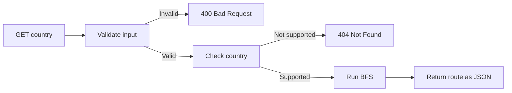

# North America Route Finder

A Flask REST API that finds a route from the USA to another supported country in North America.

The countries are stored as a graph, and BFS is used to find the route with the fewest border crossings.

## Requirements

- Python 3.11+
- Flask

## Running

Create a virtual environment:

```powershell
python -m venv venv
```

Activate it:

```powershell
.\venv\Scripts\Activate.ps1
```

Install dependencies:

```powershell
pip install -r requirements.txt
```

Run the API from the project root:

```powershell
python -m Backend.Flask_app
```

## API

Method: `GET`

Endpoint: `/<country>`

Returns the route from USA to the destination country.

Example:

```text
GET /PAN
```

Response:

```json
{
  "Route": ["USA", "MEX", "GTM", "HND", "NIC", "CRI", "PAN"],
  "from": "USA",
  "destination": "PAN"
}
```

Invalid input returns `400 Bad Request`.

Examples:

```text
/PA
```

returns an error because the country code is not three letters long.

```text
/P4N
```

returns an error because the country code contains non-letter characters.

Going to the API without entering a country:

```text
/
```

also returns `400 Bad Request` asking for a three letter country code.

A country code that has the correct format but is not supported, such as:

```text
/XYZ
```

returns `404 Not Found`.

Country codes are not case-sensitive, so:

```text
/pan
```

works the same as:

```text
/PAN
```

## How it works



`borders.json` stores the country border connections.

`Node.py` stores each country and its neighboring countries.

`Graph.py` builds the bidirectional graph and contains the BFS route search.

`Flask_app.py` reads the border data, builds the graph, and handles the API request, validation, and response.

## Assumptions

- The route always starts from `USA`
- Borders work in both directions
- The provided border data is treated as correct
- Country codes are not case-sensitive
- Shortest route means fewest border crossings
- Only countries provided in the problem are supported

Since there are no weights for distance or travel time, BFS is used. If the graph was weighted, I would use something like Dijkstra's algorithm instead.

## Testing

Run:

```powershell
python -m Backend.test_backend
```

Tests include:

- `PAN`
- `BLZ`
- `CAN`
- `USA`
- lowercase input
- invalid input
- unsupported countries
- API status codes

## Deployment

The API is deployed using Render.

Deployed link:

https://take-home-project-31l3.onrender.com/

Example:

https://take-home-project-31l3.onrender.com/PAN