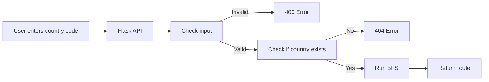

# North America Route Finder

This project is a Flask API that finds a route from the USA to another supported country in North America.

The countries are stored as a graph, and I use BFS to find the route with the fewest border crossings.

For example:

`/PAN`

returns:

```json
{
  "Route": ["USA", "MEX", "GTM", "HND", "NIC", "CRI", "PAN"],
  "from": "USA",
  "destination": "PAN"
}
```

## How it works



The project is split into a few main files:

- `Node.py` stores a country and its neighboring countries
- `Graph.py` builds the graph and finds the shortest route
- `Flask_app.py` handles the API request
- `test_backend.py` is used to test the program

## Why I used BFS

I used BFS because each connection represents one border crossing.

There is no distance or travel time being used, so in this project I assume the shortest route means the route with the fewest border crossings. This would change if the graph was weighted.

If distance or travel time was added later, I would use something like Dijkstra's algorithm instead.

## Assumptions

For this project I assumed:

- The route always starts from `USA`
- The border connections given in the problem are correct
- Borders work both ways
- Country codes are not case-sensitive
- Shortest route means fewest border crossings
- Only the countries given in the problem are supported

## Error handling

If the input is not three letters or contains something other than letters:

`/P4N`

returns:

`400 Bad Request` and `country needs to be composed of only alphabetic characters`

If the input is three letters but the country is not supported:

`/XYZ`

returns:

`404 Not Found` and `Country code is not supported. May be supported in future updates`

If the input is not the correct length of 3:

`/PA`

returns:

`400 Bad Request` and `error : Country need three letter word`

## Running the project

Create the virtual environment:

```powershell
python -m venv venv
```

Activate it:

```powershell
.\venv\Scripts\Activate.ps1
```

Install the requirements:

```powershell
pip install -r requirements.txt
```

Run the Flask API from the main project folder:

```powershell
python -m Backend.Flask_app
```

Then you can test it in the browser with something like:

`http://127.0.0.1:5000/PAN`

## Testing

To run the backend tests:

```powershell
python -m Backend.test_backend
```

Some cases I test are:

- `PAN`
- `BLZ`
- `CAN`
- `USA`
- lowercase input
- invalid input
- unsupported countries

## Deployment

Deployed link:

` Will Coming soon once I finish testing the api properly`